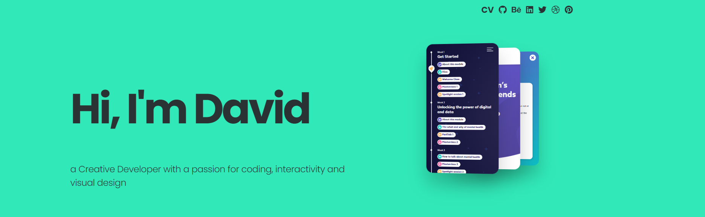

### Hi there 👋
I'm David (He/Him)

As a creative developer, I have a passion for coding, interactivity and visual design.

## Coding 👨‍🚀
I'm currently doing a Web Developement bootcamp with HyperionDev. Although I have working experience developing interactive digital experiences, everything I've learnt is self-taught, so doing this bootcamp is a certified recognition of my frontend skills.

My top coding <i>Power-ups</i>

| Rank | Languages |
|-----:|-----------|
|     1| Javascript |
|     2| React       |
|     3| TailwindCSS |
|     4| CSS         |
|     5| HTML       |
|     6| PHP       |
|     7| SQL       |
  

## Read more 🚀
Please give my website a visit: [davidlopes.media](https://davidlopes.media)

<!--
**davidllopes/davidllopes** is a ✨ _special_ ✨ repository because its `README.md` (this file) appears on your GitHub profile.

Here are some ideas to get you started:

- 🔭 I’m currently working on ...
- 🌱 I’m currently learning ...
- 👯 I’m looking to collaborate on ...
- 🤔 I’m looking for help with ...
- 💬 Ask me about ...
- 📫 How to reach me: ...
- 😄 Pronouns: ...
- ⚡ Fun fact: ...
-->
